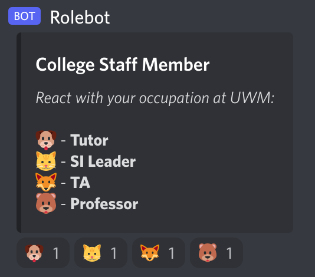

# CS Smart Club Bot

## Table of Contents

1. [Prerequisites](#prerequisites)
2. [Setting up the bot](#setting-up-the-bot)
3. [Project structure](#project-structure)
4. [Features](#features)
5. [Resources](#resources)

## Prerequisites

**Python 3.8 or later is required to run this bot.** To check your python version, open a terminal and run:
```bash
$ python --version
```
You can also try:
```bash
$ python2 --version
```
and 
```bash
$ python3 --version
```
Out of those three, use the interpreter of a version that is equal or higher than the one mentioned above. If you do not have the correct version, [you can download it here.](https://www.python.org/downloads/release/python-3105/)

**Once that's done, [download Discord.py here](https://discordpy.readthedocs.io/en/stable/intro.html).**

Next, clone the project to a folder on your machine:
```bash
git clone https://github.com/llisaeva/Rolebot.git
```
If you don't have git, you can either download the project as a zip file **(Code > Download ZIP)**, or [download git](https://git-scm.com/downloads).

**You will need a server to test the bot on. Create your own 'private' Discord server.**

## Setting up the bot

After you have the project and a server, go to the [Discord Developer Portal](https://discord.com/developers/applications). If you are prompted to log in, use the same credentials that you use for your Discord account. 

Once that's done, create a new application **(Applications > New Application)**.


Name your application any way you like, and click **Create**.


This should take you to the 'General Information' page of your new application. In the left menu, select **Bot**.


Choose **Add Bot**.


On your new bots page, select **Reset Token**. Once the new token appears, copy the token. It will only be shown to you once.


In the project folder, open the **tkn.py** file. Paste the token between the quotes next to the TOKEN variable.

```python
TOKEN="<paste your token here>"
```

**Why you should keep your bot token a secret**:
a bot token is used to attach a script to your bot. If someone has your bot token, they can control your bot with any script they attach to it. If you want your own remote branch in this project, **please do not commit changes to this file.**

The **MAKER** variable in **tkn.py** is used to associate the bot with an author - you can replace the ID with your own (but do not commit the change). This bot has a command that will DM your ID, check the [Features](#features) section.

After that is done, generate a URL for your bot. Select **OAuth2** from the left menu, and click **URL Generator**. Choose the **bot** checkbox, and select the **Administrator** checkbox in the section that appears. Copy the URL at the bottom of the page.


Follow this link in a browser, and choose the private server you created to add your bot to. Go to the project folder, and run

```py
python rolebot.py
```
(replace *python* with the interpreter that has the correct version from the first step)

The bot should become responsive. You can check for errors in **logs/bot.txt**.


## Project Structure

All python files are located in the **modules** folder, the only exception is **rolebot.py** - it is the interface of the bot.

**modules/logger.py** - code for logging errors for this project. There are 3 log files: **logs/bot.txt**, **logs/discord.txt**, and **logs/server.txt**. bot.txt is used for errors caused by the bot, discord.txt is used for errors that are sent from your Discord server, and server.txt is used for errors logged by the machine the bot is running on.

**modules/persistance.py** - used for creating json files that need to be persisted. Currently, it keeps track of the IDs of the messages that the bot creates. This makes those messages accessable by the bot after it reboots. The message ID JSON file is stored at **json/msg_ids.json**.

**modules/role_poll.py** - module for the role reaction polls. There are two, one for selecting a college year, and another for choosing an occupation at UWM. The role reaction poll options are represented by objects that extend `ReactionPoll`. The existing classes that extend it are `CollegeYearPoll` and `CollegeStaffPoll`. You can add a new reaction poll by creating a key, extending the `ReactionPoll` class, and editing the `polls` variable, like so:

```python

MY_NEW_POLL_KEY = "new_poll_key"

class MyNewPoll(ReactionPoll):
    pass

polls = {

    ...,

    MY_NEW_POLL_KEY: 
        {   
            TITLE: "New Poll",
            DESCRIPTION: "This is your description:",
            OPTIONS:
                [
                    MyNewPoll("#1", 0xaaa, "🙂", "yay"),
                    MyNewPoll("#2", 0xccc, "😐", "meh"),
                    MyNewPoll("#3", 0xeee, "🙁", "boo"),
                ]
        }
}

```

This will assign the roles `#1`, `#2` or `#3` to the user that selects the corresponding reaction. Their colors will be `0xaaa`, `0xccc` and `0xeee`. If those roles do not exist on the server, they will be created (when checking for an existing role, only the name is matched - color is used during role creation by the bot). The last parameter needs to be unique among all polls, it is used to assign a role to a user with a command.

The base `ReactionPoll` class has one function `assign()` that can be overridden. It assigns the role that it represents to the argument **member** from the argument **server** (Guild). The `CollegeYearPoll` overrides this to make sure that the member only has one college year.

**modules/utils.py** - this file is for utility functions. Currently, it has one, it is used to find the argument `roleName` in the argument `guild` (server). If it is not found, then a role named by the argument `roleName` of the argument `roleColor` color will be created in the argument `guild`. The new or retrieved role is returned.

**tkn.py** - contains the bot token and the authors ID.

**txt/cmds.txt** - the content that is displayed when the user wants to find out what commands can be used with the bot. The **txt** folder should contain all of the project's text files that are used for displaying content.

**img** - contains project images.

**demo** - contains content for the README.md file.

**json** - folder that contains persisted JSON files. **json/msg_ids.json** has the IDs of all of the messages that this bot posts, this makes those messages accessible by the bot after it reboots. **modules/persistance.py** should be used to create the JSON files.

## Features
**$cmds** - list the commands that can be used with this bot

**$collegeYearPoll** - post a college year reaction poll. All active polls made by this bot work, you can use this to summon a poll anywhere for newcomers.


**$collegeStaffPoll** - post a college occupation reaction poll.



The bot only resonds to the event when a reaction **is added**. Currently, nothing happens when a reaction is removed.

**$assign role** - assign yourself a role, where **role** is: *prefrosh*, *freshman*, *sophomore*, *junior*, *senior*, *gradstudent*, *alumni*, *professor*, *tutor*, *ta*, *sileader*

**$assign clear** - this will only clear the roles mentioned above, **not** any special roles, like *leet gamer* or *club mod*

**$dm id** - make the bot DM your ID. This can be assigned to
the `MAKER` variable in **tkn.py**, which will make all of the 
maker commands accessible only by you. This command is not a 
maker command.

### **Maker commands**
These can only be used by an account with an ID that matches `MAKER` in **tkn.py**. You can 
change the `MAKER` ID to your own ID.

**$dm botlogs** - DMs logs/bot.txt 

**$dm discordlogs** - DMs logs/discord.txt

**$dm serverlogs** - DMs logs/server.txt

**$die** - shuts down the bot

## Resources

 - [Discord.py Tutorial](https://discordpy.readthedocs.io/en/stable/ext/commands/commands.html)
 - [Discord.py API](https://discordpy.readthedocs.io/en/stable/api.html)


